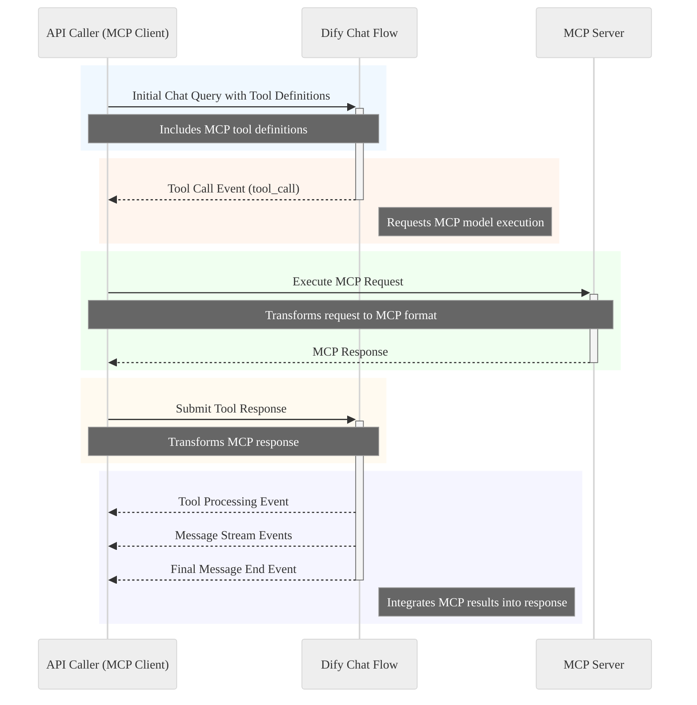

# Overview

Dify chats can be called using the following method:

## Base Endpoint
The chat API endpoint for Dify is:
```bash
POST https://dify-api.prometheus-platform.io/v1/chat-messages
```

## Request Format

**Headers:**
```http
Authorization: Bearer YOUR-API-KEY
Content-Type: application/json
```

**Request Body:**
```json
{
    "inputs": {},
    "query": "Your message here",
    "response_mode": "streaming",
    "conversation_id": "optional-conversation-id",
    "user": "user-identifier"
}
```

## Conversation Flow

**Starting a New Chat:**
- Omit the `conversation_id` or leave it empty
- Include your initial query in the `query` field
- The response will include a new `conversation_id`

**Continuing a Conversation:**
```json
{
    "inputs": {},
    "query": "Follow-up question",
    "response_mode": "streaming",
    "conversation_id": "previous-conversation-id",
    "user": "user-identifier"
}
```

## Response Modes

**Streaming Response:**
When `response_mode: "streaming"`, you'll receive events in this sequence:
1. Message start event
2. Multiple message stream events with partial content
3. Message end event
4. Workflow finished event (for workflow applications)

**Non-Streaming Response:**
Set `response_mode: "blocking"` to receive a complete response in a single JSON object.

## Optional Parameters

- `inputs`: Additional context or variables
- `files`: Array of file objects for image or document processing
- `user`: Identifier for tracking user interactions

## File Attachments
Include files in your chat using:
```json
{
    "files": [
        {
            "type": "image",
            "transfer_method": "remote_url",
            "url": "https://example.com/image.jpg"
        }
    ]
}
```

Citations:
[1] https://doc.evolution-api.com/v2/en/integrations/dify
[2] https://www.restack.io/p/dify-answer-open-api-examples-cat-ai
[3] https://www.restack.io/p/dify-answer-chat-history-cat-ai
[4] https://docs.dify.ai/guides/application-publishing/developing-with-apis
[5] https://github.com/langgenius/dify/discussions/6134
[6] https://www.restack.io/p/dify-answer-api-base-cat-ai
[7] https://github.com/langgenius/dify/blob/main/web/app/components/develop/template/template_advanced_chat.en.mdx
[8] https://docs.dify.ai/guides/extension/api-based-extension

## Blocking Response Format

When using `response_mode: "blocking"`, you'll receive a single JSON response:

```json
{
    "id": "thought-id",
    "message_id": "message-unique-id",
    "conversation_id": "session-id",
    "mode": "chat",
    "answer": "Complete response content",
    "metadata": {
        // Additional metadata about the response
    },
    "created_at": 1705395332
}
```

## Streaming Events Sequence

When using `response_mode: "streaming"`, events arrive in the following order:

### 1. Message Start Event
```json
{
    "event": "message_start",
    "id": "thought-id",
    "message_id": "message-id",
    "conversation_id": "session-id",
    "created_at": 1705395332
}
```

### 2. Message Stream Events
Multiple stream events containing partial content:
```json
{
    "event": "message_stream",
    "id": "thought-id",
    "message_id": "message-id",
    "conversation_id": "session-id",
    "answer": "Partial response content",
    "created_at": 1705395332
}
```

### 3. Message End Event
```json
{
    "event": "message_end",
    "id": "thought-id",
    "message_id": "message-id",
    "conversation_id": "session-id",
    "answer": "Complete response content",
    "metadata": {
        // Additional metadata
    },
    "created_at": 1705395332
}
```

## Additional Events

### Error Event
```json
{
    "event": "error",
    "status": "error_status",
    "message": "Error description",
    "code": "error_code"
}
```

### Audio Response (When TTS Enabled)
```json
{
    "event": "message_file",
    "data": {
        // Audio file data
    }
}
```

## Processing Considerations

- Each streaming chunk starts with `data:` and is separated by two newline characters (`\n\n`)[6]
- The `conversation_id` should be stored and used for continuing conversations[6]
- Audio data is returned in the same stream as text responses when Text to Speech is enabled[8]
- Responses may timeout after 100 seconds due to Cloudflare limitations[9]

Citations:
[1] https://www.restack.io/p/dify-add-option-for-blocking-in-api-call-to-chat-agent
[2] https://docs.dify.ai/guides/application-publishing/developing-with-apis
[3] https://www.openwebui.com/f/xuzhougneg/dify_manifold
[4] https://github.com/langgenius/dify/issues/2992
[5] https://www.restack.io/p/dify-answer-open-api-examples-cat-ai
[6] https://github.com/langgenius/dify/blob/main/web/app/components/develop/template/template_advanced_chat.en.mdx
[7] https://pkg.go.dev/github.com/kervinchang/dify-go
[8] https://dev.to/ku6ryo/how-to-realize-real-time-speech-with-dify-api-4ii1
[9] https://docs.rs/dify-client/latest/dify_client/request/index.html

## File Input Methods for Chat Messages

### Method 1: Direct File Upload
First, upload the file:
```bash
curl -X POST 'https://dify-api.prometheus-platform.io/v1/files/upload' \
-H 'Authorization: Bearer YOUR-API-KEY' \
-F 'file=@/path/to/file.jpg'
```

Response:
```json
{
    "id": "file_id_12345",
    "name": "file.jpg",
    "url": "internal_file_reference"
}
```

Then use in chat:
```json
{
    "query": "Analyze this file",
    "files": [{
        "type": "image",
        "transfer_method": "local_file",
        "url": "file_id_12345"
    }]
}
```

### Method 2: Remote URL
```json
{
    "query": "What's in this image?",
    "files": [{
        "type": "image",
        "transfer_method": "remote_url",
        "url": "https://example.com/image.jpg"
    }]
}
```

### Method 3: Base64 Encoding
```json
{
    "query": "Process this file",
    "files": [{
        "type": "image",
        "transfer_method": "base64",
        "data": "data:image/jpeg;base64,/9j/4AAQSkZJRgABAQEAYABgAAD..."
    }]
}
```

## Multiple Files Using Mixed Methods
```json
{
    "query": "Analyze these files",
    "files": [
        {
            "type": "document",
            "transfer_method": "remote_url",
            "url": "https://example.com/doc.pdf"
        },
        {
            "type": "image",
            "transfer_method": "base64",
            "data": "data:image/jpeg;base64,/9j/4AAQSkZJRgABAQEAYABgAAD..."
        },
        {
            "type": "document",
            "transfer_method": "local_file",
            "url": "file_id_67890"
        }
    ]
}
```

## File Type Specifications

| File Type | Extensions | Size Limit | Transfer Methods |
|-----------|------------|------------|------------------|
| document  | pdf, docx, txt | 50MB | all |
| image     | jpg, png, webp | 10MB | all |
| audio     | mp3, wav, m4a | 20MB | all |
| video     | mp4, mov, webm | 100MB | all |

## Important Notes

- Base64 files require proper MIME type prefix
- Remote URLs must be publicly accessible
- File upload endpoint returns an ID valid for 30 minutes
- Maximum of 10 files per chat message
- Supported content types vary by model capabilities
- File processing may increase response time
- Some file types require specific model capabilities

## Tool Calling Implementation

Tool calling in Dify can be implemented through two primary inference modes: Function Calling and ReAct[4]. 

## Function Calling Mode

For models supporting native function calling (like GPT-3.5 and GPT-4), the implementation is straightforward:

```json
{
    "inputs": {},
    "query": "What's the weather?",
    "response_mode": "streaming",
    "tools": [
        {
            "name": "get_weather",
            "description": "Get current weather",
            "parameters": {
                "type": "object",
                "properties": {
                    "location": {
                        "type": "string",
                        "description": "City name"
                    }
                },
                "required": ["location"]
            }
        }
    ]
}
```

## ReAct Framework Support

For models without native function calling support, Dify implements the ReAct inference framework[4]. This allows tools to be invoked through a structured thought process:

1. The model receives tools as part of the context
2. It generates reasoning steps
3. It explicitly states which tool to use
4. The system executes the tool call
5. Results are fed back to the model

## Tool Types

Dify supports two categories of tools[4]:

- **Built-in tools**: Pre-configured tools available in the platform
- **Custom tools**: User-defined tools via OpenAPI/Swagger or OpenAI Plugin standards

## Orchestrated Chat Flow Integration

In the chat flow, tools can be configured at the Agent node level[4]. The process involves:

1. Adding tools in the "Tools" section
2. Setting iteration limits for tool usage
3. Configuring conversation openers
4. Defining initial questions

## DSL Configuration

For models without direct tool calling support, the DSL can be configured to handle tool calls through intermediary nodes:

```yaml
nodes:
  - type: "agent"
    tools:
      - name: "tool_name"
        type: "built_in"
        config:
          inference_mode: "react"
          max_iterations: 3
    fallback:
      type: "llm"
      model: "downstream_model"
```

## Important Considerations

- Tool calling requires proper authentication in API headers[2]
- Responses may include tool execution results in the streaming events[3]
- Maximum iterations should be set to prevent infinite loops[4]
- Tools must be properly defined in the application configuration before API calls[6]

Citations:
[1] https://www.pingcap.com/blog/dify-tidb-build-scalable-ai-agent-with-knowledge-base/
[2] https://docs.dify.ai/guides/application-publishing/developing-with-apis
[3] https://www.j000e.com/AI/Getting_Started_with_Dify.html
[4] https://docs.dify.ai/guides/application-orchestrate/agent
[5] https://www.restack.io/p/dify-answer-prompt-techniques-cat-ai
[6] https://www.restack.io/p/dify-answer-api-docs-cat-ai
[7] https://www.restack.io/p/dify-answer-dify-dsl-cat-ai
[8] https://docs.dify.ai/guides/application-orchestrate
[9] https://github.com/langgenius/dify/issues/10967
[10] https://docs.dify.ai/guides/workflow/orchestrate-node

## Tool Calling Support

## Tool Calling Response Flow

### 1. Initial Tool Call Detection

When a tool call is detected, you'll receive this event:
```json
{
    "event": "tool_call",
    "id": "thought-id",
    "message_id": "message-id",
    "conversation_id": "session-id",
    "tool": {
        "name": "get_weather",
        "arguments": {
            "location": "Dallas"
        }
    }
}
```

### 2. Tool Response Submission

After executing the tool, submit the result:
```javascript
const toolResponse = {
    "tool_name": "get_weather",
    "tool_response": {
        "temperature": 72,
        "conditions": "sunny",
        "humidity": 45
    }
}

await fetch('https://dify-api.prometheus-platform.io/v1/chat-messages/tool-response', {
    method: 'POST',
    headers: {
        'Authorization': 'Bearer YOUR-API-KEY',
        'Content-Type': 'application/json'
    },
    body: JSON.stringify({
        "conversation_id": "session-id",
        "message_id": "message-id",
        "tool_response": toolResponse
    })
});
```

### 3. Processing Continued Response

After tool response submission, you'll receive these events:

**Tool Processing Event:**
```json
{
    "event": "tool_processing",
    "id": "thought-id",
    "message_id": "message-id",
    "conversation_id": "session-id",
    "tool_response": {
        "name": "get_weather",
        "response": {
            "temperature": 72,
            "conditions": "sunny",
            "humidity": 45
        }
    }
}
```

**Continued Message Stream:**
```json
{
    "event": "message_stream",
    "id": "thought-id",
    "message_id": "message-id",
    "conversation_id": "session-id",
    "answer": "Based on the weather data, it's a beautiful sunny day..."
}
```

### 4. Multiple Tool Calls

Handle multiple sequential tool calls:
```javascript
async function processToolCalls(stream) {
    for await (const chunk of stream) {
        const event = JSON.parse(chunk);
        
        if (event.event === 'tool_call') {
            const toolResult = await executeToolCall(event.tool);
            await submitToolResponse(event.message_id, toolResult);
            continue;
        }
        
        if (event.event === 'message_end') {
            break;
        }
        
        // Process other events normally
        processNormalEvent(event);
    }
}
```

### 5. Error Handling

Handle tool execution failures:
```javascript
async function submitToolError(messageId, error) {
    await fetch('https://dify-api.prometheus-platform.io/v1/chat-messages/tool-response', {
        method: 'POST',
        headers: {
            'Authorization': 'Bearer YOUR-API-KEY',
            'Content-Type': 'application/json'
        },
        body: JSON.stringify({
            "conversation_id": "session-id",
            "message_id": messageId,
            "tool_response": {
                "tool_name": "get_weather",
                "error": {
                    "message": error.message,
                    "code": error.code
                }
            }
        })
    });
}
```

## Processing Considerations

- Tool calls may occur multiple times in a single conversation
- Each tool call must be responded to before the conversation continues
- Tool responses should be formatted according to the tool's defined schema
- Error responses should include sufficient detail for the LLM to handle gracefully
- Implement timeouts for tool execution and response submission

## Model Context Protocol Use

## Complete MCP Tool Call Flow

### 1. Initial Dify Chat Message
```json
{
    "query": "Analyze the protein folding patterns in sample PS-789",
    "response_mode": "streaming",
    "conversation_id": "conv-123",
    "tools": [
        {
            "name": "protein_analysis_mcp",
            "description": "Analyze protein structures using MCP-enabled research models",
            "parameters": {
                "type": "object",
                "properties": {
                    "sample_id": {
                        "type": "string",
                        "description": "Sample identifier"
                    },
                    "analysis_type": {
                        "type": "string",
                        "enum": ["folding", "binding", "stability"]
                    },
                    "additional_parameters": {
                        "type": "object"
                    }
                },
                "required": ["sample_id", "analysis_type"]
            }
        }
    ]
}
```

### 2. Dify Tool Call Event
```json
{
    "event": "tool_call",
    "id": "thought-456",
    "message_id": "msg-789",
    "conversation_id": "conv-123",
    "tool": {
        "name": "protein_analysis_mcp",
        "arguments": {
            "sample_id": "PS-789",
            "analysis_type": "folding",
            "additional_parameters": {
                "temperature": 310,
                "ph": 7.4
            }
        }
    }
}
```

### 3. API Caller's MCP Client Implementation
```javascript
async function processMCPToolCall(toolCallEvent) {
    // Initialize MCP client
    const mcpClient = new MCPClient({
        endpoint: "https://protein-research.mcp.example.com",
        apiKey: "mcp-key"
    });

    // Transform to MCP request format
    const mcpRequest = {
        type: "predict",
        model: "protein_folding_analyzer",
        inputs: {
            sample: toolCallEvent.tool.arguments.sample_id,
            configuration: {
                analysis: toolCallEvent.tool.arguments.analysis_type,
                conditions: toolCallEvent.tool.arguments.additional_parameters
            }
        },
        context: {
            request_id: toolCallEvent.id,
            session_id: toolCallEvent.conversation_id
        }
    };

    try {
        // Execute MCP call
        const mcpResponse = await mcpClient.predict(mcpRequest);

        // Submit response back to Dify
        await submitToolResponse(mcpResponse, toolCallEvent);
    } catch (error) {
        await handleMCPError(error, toolCallEvent);
    }
}
```

### 4. MCP Response Submission to Dify
```javascript
async function submitToolResponse(mcpResponse, originalEvent) {
    const response = await fetch('https://dify-api.prometheus-platform.io/v1/chat-messages/tool-response', {
        method: 'POST',
        headers: {
            'Authorization': 'Bearer YOUR-API-KEY',
            'Content-Type': 'application/json'
        },
        body: JSON.stringify({
            conversation_id: originalEvent.conversation_id,
            message_id: originalEvent.message_id,
            tool_response: {
                tool_name: "protein_analysis_mcp",
                tool_response: {
                    results: mcpResponse.predictions,
                    metadata: {
                        model_version: mcpResponse.model_info.version,
                        execution_time: mcpResponse.metrics.duration,
                        confidence_score: mcpResponse.metrics.confidence
                    }
                }
            }
        })
    });
}
```

### 5. Dify Processing Events
```json
{
    "event": "tool_processing",
    "id": "thought-456",
    "message_id": "msg-789",
    "conversation_id": "conv-123",
    "status": "processing"
}
```

### 6. Dify Response Integration
```json
{
    "event": "message_stream",
    "id": "thought-456",
    "message_id": "msg-789",
    "conversation_id": "conv-123",
    "answer": "The protein folding analysis of sample PS-789 shows a stable alpha-helix structure..."
}
```

### 7. Final Completion Event
```json
{
    "event": "message_end",
    "id": "thought-456",
    "message_id": "msg-789",
    "conversation_id": "conv-123",
    "answer": "Complete analysis of protein folding patterns in sample PS-789...",
    "metadata": {
        "tool_calls": [
            {
                "name": "protein_analysis_mcp",
                "execution_time": 2.3,
                "status": "success"
            }
        ]
    }
}
```

## Error Handling Example
```javascript
async function handleMCPError(error, originalEvent) {
    await fetch('https://dify-api.prometheus-platform.io/v1/chat-messages/tool-response', {
        method: 'POST',
        headers: {
            'Authorization': 'Bearer YOUR-API-KEY',
            'Content-Type': 'application/json'
        },
        body: JSON.stringify({
            conversation_id: originalEvent.conversation_id,
            message_id: originalEvent.message_id,
            tool_response: {
                tool_name: "protein_analysis_mcp",
                error: {
                    code: error.code || 'MCP_ERROR',
                    message: error.message,
                    details: error.details || {}
                }
            }
        })
    });
}
```

### Flow Diagram



